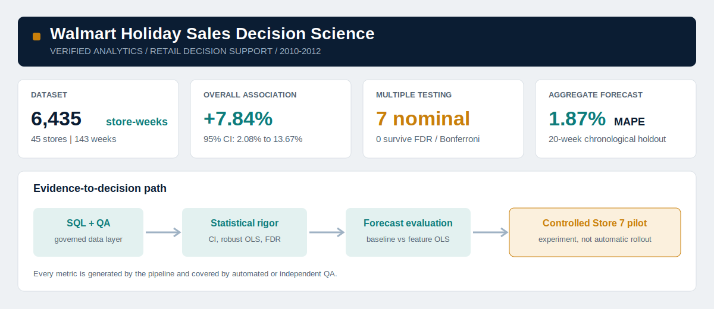
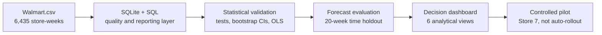

<div align="center">

# Walmart Holiday Sales Decision Science

### From 6,435 store-weeks to an evidence-qualified retail decision

[](https://www.python.org/)
[](https://www.sqlite.org/)
[](tests/test_pipeline.py)
[](dashboard/data/forecast_metrics.csv)
[](data/Walmart.csv)

**Python | SQL | Statistical inference | Robust regression | Forecasting | Automated QA | Chart.js | Power BI handoff**

[Explore the dashboard](dashboard/Walmart_Dashboard.html) ·
[Read the decision brief](docs/ONE_PAGER.pdf) ·
[Review the methodology](docs/METHODOLOGY.md) ·
[Inspect QA evidence](docs/QA_NOTES.md)

</div>



> [!IMPORTANT]
> This dataset has no product price, markdown amount, margin, inventory, or SKU fields. The project estimates **holiday-week sales associations**, not price elasticity or causal markdown ROI.

## The decision

Walmart planners need to know where holiday-period demand is strong enough to justify a controlled commercial test, without confusing noisy historical correlations with proven markdown impact.

This project turns a small observational dataset into a governed decision workflow:



## Executive findings

| Finding | Verified result | Decision interpretation |
|---|---:|---|
| Overall flagged-week lift | **7.84%** | Positive association; 95% CI **2.08% to 13.67%**, Mann-Whitney p=0.0259 |
| Store-level evidence | **7 / 45 nominal screens** | Exploratory only; **0 / 45** survive Bonferroni or FDR correction |
| Strongest descriptive store | **Store 7: 19.44% lift** | Candidate for a controlled pilot, not an automatic rollout |
| Aggregate forecast | **1.87% MAPE** | Feature OLS beats seasonal naive at 2.24% on the final 20 weeks |
| Model wins across scopes | **OLS 24 / Naive 22** | Complexity is not universally better; retain a store-specific baseline |
| Data-quality finding | **December flag is post-Christmas** | The two flagged weeks average 7.7% below regular weeks and should not be labelled Christmas demand |

## Why this is a decision-science project

The work goes beyond descriptive charts by connecting each technical step to a business decision and an evidence threshold.

| Capability | Implementation | Business value |
|---|---|---|
| Data engineering | Validated CSV-to-SQLite load, indexes, reporting views, clear failures | Reproducible and auditable analytical base |
| SQL analytics | CTEs, window ranking, quartiles, segmentation, governed views | Store-level prioritization and reusable BI outputs |
| Statistical inference | Normality diagnostics, Welch/Mann-Whitney selection, 5,000-draw bootstrap CIs | Quantifies uncertainty instead of reporting lift alone |
| Multiplicity control | Bonferroni and Benjamini-Hochberg FDR across 45 tests | Prevents nominal false positives from becoming rollout claims |
| Regression | Store-level HC3-robust OLS and pooled store fixed effects | Measures conditional macro associations with fit diagnostics |
| Forecasting | Seasonal-naive baseline versus feature OLS | Tests whether complexity improves future-period accuracy |
| Model evaluation | Chronological 20-week holdout, MAPE and RMSE | Avoids shuffled time-series validation and benchmark-free claims |
| Communication | Six-tab dashboard, one-page decision brief, Power BI package | Translates uncertainty into an executive recommendation |
| Engineering QA | Independent recomputation, DOM/data contracts, fresh-clone test | Makes every headline claim traceable and repeatable |

## Dashboard walkthrough

The generated dashboard is a self-contained offline HTML file using the repository's bundled Chart.js asset.

| View | What it answers |
|---|---|
| **Executive KPI** | What happened across all 45 stores and 143 weeks? |
| **Holiday Impact** | Which stores show lift, and how uncertain is it? |
| **Holiday Type Breakdown** | How do the four competition-defined weeks differ? |
| **Economic Sensitivity** | Which conditional macro associations are detectable, and how well do models fit? |
| **Forecast & Model Evaluation** | Which model wins on unseen future weeks for each store and aggregate? |
| **Store Recommendations** | Where is a pilot justified, directional, or unsupported? |

### Add genuine report screenshots

The repository intentionally does not include fabricated screenshots. After opening the dashboard or building the PBIX, export three real images to `powerbi/screenshots/`:

1. `executive_overview.png`
2. `holiday_confidence.png`
3. `forecast_evaluation.png`

The exact capture checklist is in [powerbi/VALIDATION_CHECKLIST.md](powerbi/VALIDATION_CHECKLIST.md).

## Statistical honesty

The strongest feature of this project is not a larger claim; it is a better-calibrated one.

- The overall comparison contains 450 holiday rows and 5,985 regular rows, but only **10 distinct holiday calendar weeks**.
- Each store has only 10 flagged observations versus 133 regular observations.
- Eight stores have unadjusted p<0.05; seven also have a positive bootstrap interval.
- After correcting 45 simultaneous store tests, **none survives Bonferroni or FDR control**.
- Store 7 remains useful as the highest-priority **experiment candidate**, not as a confirmed causal winner.

That distinction is carried consistently through the CSV outputs, dashboard labels, methodology, QA notes, and executive brief.

## Forecast design

Two models are evaluated on the same final 20 weeks (2012-06-15 to 2012-10-26):

1. **Seasonal naive:** sales from 52 weeks earlier.
2. **Feature OLS:** lag-52 sales, holiday flag, fuel price, CPI, unemployment, and trend.

No random shuffle is used. The seasonal baseline is retained even when OLS wins because it is transparent, difficult to overfit, and competitive across 22 of 46 scopes.

> [!NOTE]
> Feature OLS uses observed macro values in the historical holdout. A live deployment would require macro forecasts or scenarios.

## Run it yourself

### Requirements

- Python 3.13
- No external database server
- No web server for the dashboard

### Two-command setup

```bash
python -m pip install -r requirements.txt
python scripts/run_pipeline.py
```

Then open:

```text
dashboard/Walmart_Dashboard.html
```

On macOS/Linux, the wrapper is also available:

```bash
sh scripts/run_pipeline.sh
```

### What the pipeline rebuilds

```text
CSV validation and SQLite load
  -> SQL analyses and reporting views
  -> statistical tests and robust regressions
  -> forecast predictions and evaluation metrics
  -> dashboard data and offline HTML
  -> print-ready one-page PDF
  -> complete pytest suite
```

Expected final output:

```text
........                                                                 [100%]
8 passed
Pipeline completed successfully.
```

## Repository structure

```text
walmart-holiday-decision-science/
├── analysis/              # Statistical inference, regression and forecasting
├── dashboard/             # Generated offline dashboard and governed CSV outputs
├── data/                  # Kaggle source CSV; SQLite DB is regenerated and ignored
├── docs/                  # Methodology, QA notes and one-page hiring brief
├── powerbi/               # Theme, Power Query, DAX, model and report specification
├── qa/                    # Independent result and presentation-contract checks
├── scripts/               # Load, orchestration, dashboard and PDF builders
├── sql/                   # CTE/window analyses and reporting views
├── tests/                 # Pipeline regression tests
├── requirements.txt       # Python 3.13-compatible pinned dependencies
└── README.md
```

## Reproducibility and QA

The project has been verified in a fresh Python 3.13 environment and a clean local clone with no prebuilt SQLite database.

Automated checks cover:

- 6,435-row database load
- Non-null key columns and expected schema types
- Exactly 10 distinct flagged holiday weeks
- SQL lift recomputation from raw data
- Independent 7.839713% lift and 2.079147%-13.666078% bootstrap interval
- Statistical, regression, and forecast artifact contracts
- Six dashboard tabs, seven chart canvases, and five populated table targets
- Power BI source, measure, theme, and headline contracts

See [docs/QA_NOTES.md](docs/QA_NOTES.md) for the full evidence trail.

## Power BI handoff

The repository includes a complete Power BI build package:

- Portable Power Query imports
- Star-style store model
- Reconciled DAX measures
- Navy/teal/amber theme
- Six-page report blueprint
- Pre-submission validation checklist

Start with [powerbi/README.md](powerbi/README.md). The `.pbix` is not committed because Power BI Desktop was not available in the build environment; the repository does not claim an artifact that was not actually created.

## Business recommendation

Run a controlled holiday-markdown pilot at Store 7 with:

- matched comparison stores;
- predefined margin-aware success metrics;
- inventory and stockout monitoring;
- pre/post analysis with an explicit causal design;
- seasonal naive retained as the forecast governance baseline.

The next data investment should add SKU-level price, units, markdown depth, margin, inventory, and control-group information. Only then can the analysis estimate true markdown ROI or price elasticity.

## Portfolio artifacts

- [Interactive offline dashboard](dashboard/Walmart_Dashboard.html)
- [Executive one-page PDF](docs/ONE_PAGER.pdf)
- [Technical methodology](docs/METHODOLOGY.md)
- [Quality-assurance notes](docs/QA_NOTES.md)
- [Power BI implementation package](powerbi/README.md)
- [Forecast evaluation data](dashboard/data/forecast_metrics.csv)
- [Statistical test data](dashboard/data/statistical_tests.csv)

## Technology

`Python` · `Pandas` · `SciPy` · `Statsmodels` · `SQL` · `SQLite` · `Pytest` · `HTML` · `CSS` · `JavaScript` · `Chart.js` · `DAX` · `Power Query` · `ReportLab` · `GitHub Actions`

---

<div align="center">
Built as a decision-science portfolio project: rigorous enough to defend technically, clear enough to present to a client, and honest enough to distinguish evidence from ambition.
</div>
